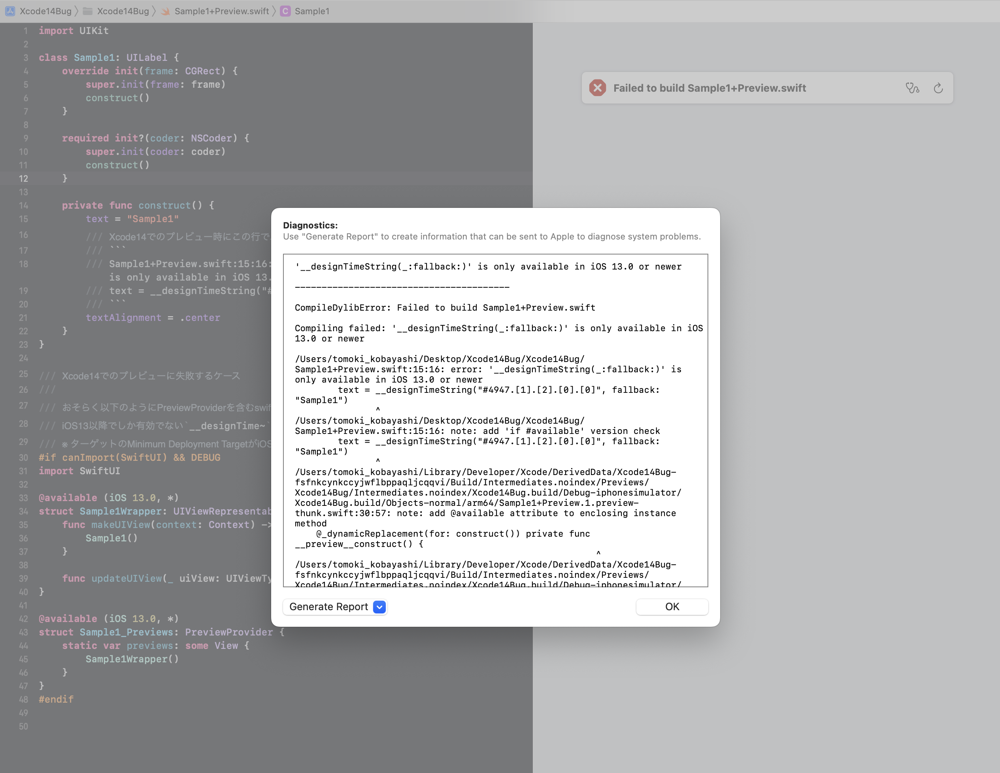
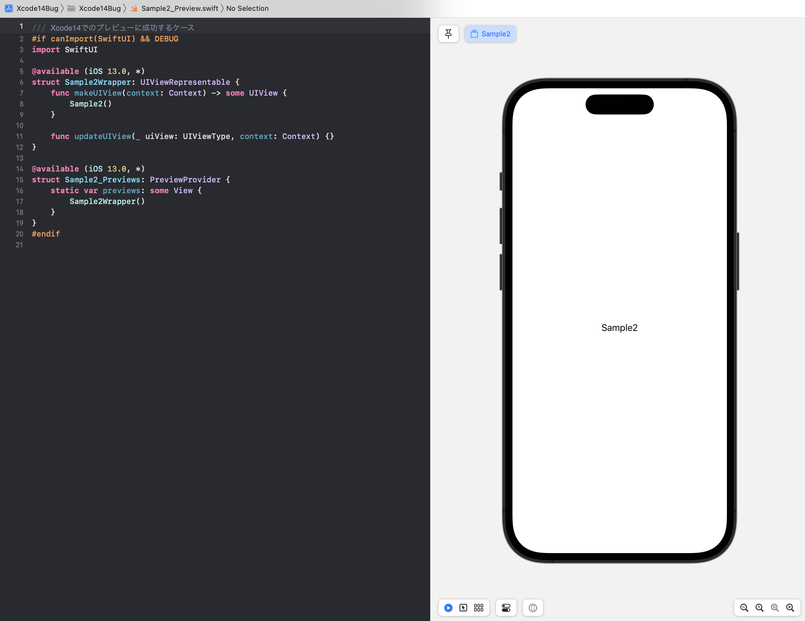

# Xcode14バグレポート

## Xcode14バグレポート

### 概要
`UIViewRepresentable`で実装したViewをXcode14でプレビューした場合に次のエラーとなる

```
Sample1+Preview.swift:15:16: error: '__designTimeString(_:fallback:)' is only available in iOS 13.0 or newer
text = __designTimeString("#4947.[1].[2].[0].[0]", fallback: "Sample1")
```

### 再現条件    
- UIKitのViewを`UIViewRepresentable`でラップし、PreviewProviderでプレビュー表示する
- Minimum DeploymentがiOS13未満に設定されている（iOS13以降にすると再現しない）
- Xcode 14 もしくは 14.1Beta を利用している（Xcode13系では再現しない）
- PreviewProviderは次の手段によりSwiftUIが利用できるiOS13以降のみコンパイル対象としている
    - `#if canImport(SwiftUI)`
    - `@available (iOS 13.0, *)`
- UIKitのViewのコードと、PrewviewProviderのコードが同じSwiftソースファイルの中に含まれる

### 考察
- Xcode Previewのために、Swiftコード内にあるプリミティブ型の定数が `__designTime~(_:fallback:)` という関数に置き換えられる。
- UIKitのViewのコードと、PrewviewProviderのコードが同じSwiftソースファイルの中に含まれる場合、UIKitのViewのコードまで置き換えられてしまう。
- `__designTime~(_:fallback:)` はSwiftUIのための非公開APIのため、iOS13以降でしか利用できず、コンパイルエラーとなってしまう。

### サンプルコード
#### Sample1 : 再現するパターン


- `Sample1+Preview.swift`には以下のコードが含まれる
    - UIKitのView`Sample1`のコード
    - `Sample1`を`UIViewRepresentable`でラップした`Sample1Wrapper`のコード
    - `Sample1Wrapper`を`PreviewProvider`でプレビューするための`Sample1_Previews`のコード

#### Sample2 : 再現しないパターン


- `Sample2.swift`には以下のコードが含まれる
    - UIKitのView`Sample2`のコード
- `Sample2_Preview.swift`には以下のコードが含まれる
    - `Sample2`を`UIViewRepresentable`でラップした`Sample2Wrapper`のコード
    - `Sample2Wrapper`を`PreviewProvider`でプレビューするための`Sample2_Previews`のコード
    


